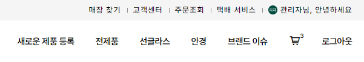
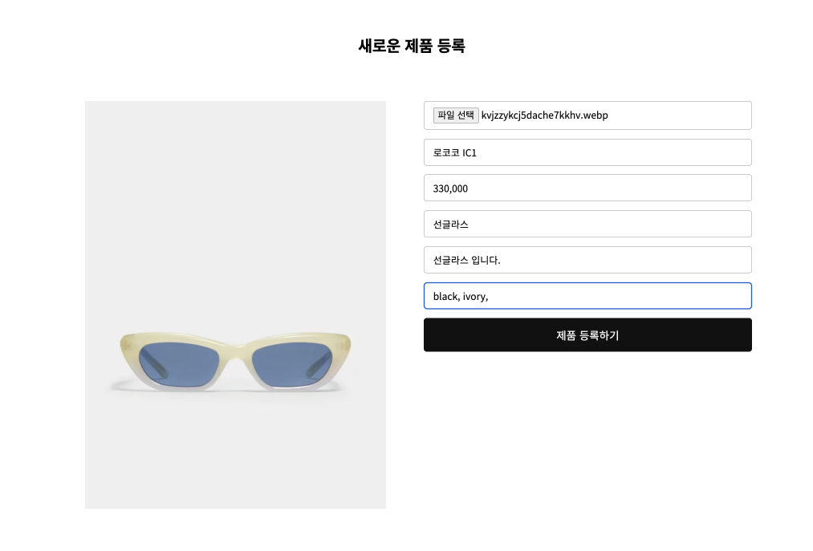
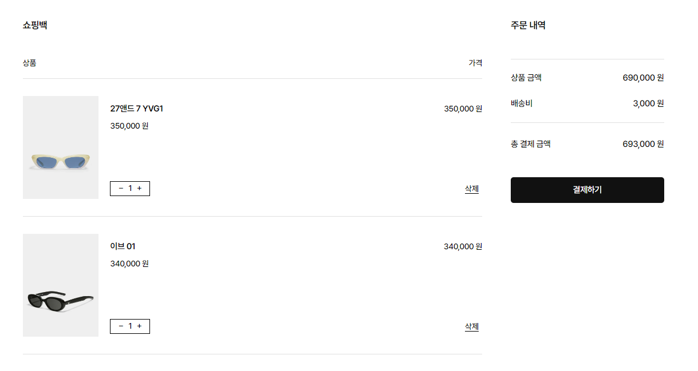

# GENTLE MONSTER [](https://delicate-longma-d20402.netlify.app/)
> A curated list of gentle-monster READMEs

<br>

## 👀 프로젝트 소개

젠틀몬스터 공식사이트를 참고하여 만든 쇼핑몰 사이트입니다. (포트폴리오용으로 제작되었습니다.) <br>
🔗 [배포 링크](https://delicate-longma-d20402.netlify.app/) 

<br>

## 📝 사용기술

    

<br>

## 📍 주요 기능

#### 1. 로그인 



* firebase의 사용자의 로그인 상태를 관리하는 `onAuthStateChanged()`를 사용하여 기존에 로그인 한 user를 기억하고 새로운 user가 로그인 할 경우, callback 함수에 updatedUser를 전달받을 수 있도록 하였습니다. 
    
    ```jsx
    export function onUserStateChange(callback) {
      onAuthStateChanged(auth, async (user) => {
        const updatedUser = user ? await adminUser(user) : user;
        callback(updatedUser);
      });
    }
    ```

<br>

#### 2. 새로운 제품 등록

👩🏻‍💻 **admin** 아이디, 비밀번호 입니다.
    
    아이디: teest0208@gmail.com
    비밀번호: test1234@@
    
    
* firebase에 admin의 **uid**를 지정하여 admin 사용자로 로그인 할 경우, 새로운 제품 등록 페이지에 접근 가능하도록 구현하였습니다.



* 등록된 제품은 **firebase**와 **cloudinary**에서 수정, 관리가 가능하도록 하였습니다.

<br>

#### 3. 장바구니



* firebase의 실시간 데이터베이스의 `set()`을 사용하여 지정된 carts, userId에 사용자가 장바구니에 담은 제품이 추가되도록 하였습니다.
    
    ```jsx
    export async function addOrUpdateToCart(userId, product) {
      return set(ref(database, `carts/${userId}/${product.id}`), product);
    }
    ```

<br>

#### 4. 제품 상세보기

* react-router를 사용해 제품 id를 주소 경로로 설정하고 `useLocation()`로 현재 페이지의 객체 정보를 얻어올 수 있도록 하였습니다.

<br>
